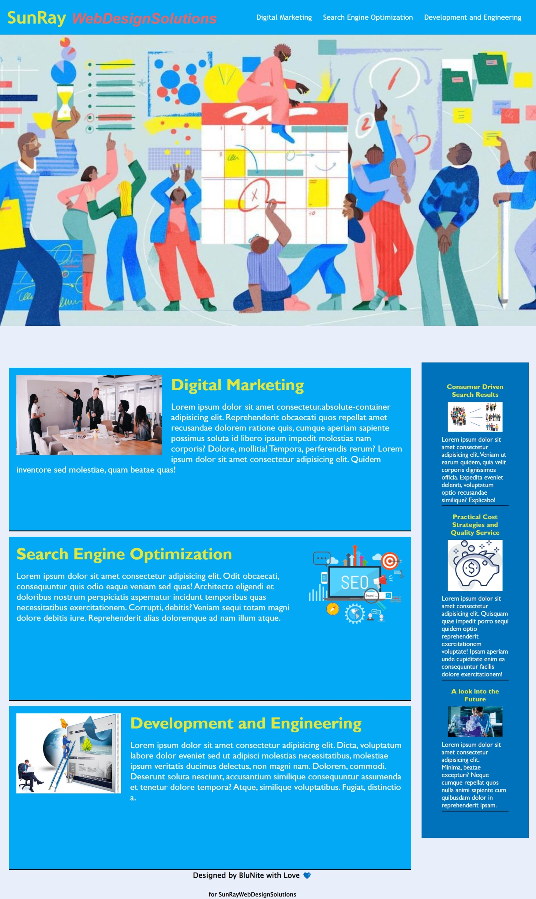

[](https://opensource.org/licenses/MIT)   

# 01 HTML, CSS and GIT: Code Refractor

## Task

**Refactoring** existing code (improving it without changing what it does) to meet a certain set of standards or to implement a new technology is a common task for front-end and junior developers.

## User Story

```
AS A marketing agency
I want a codebase that follows accessibility standards
SO THAT our own site is optimized for search engines

```
## Deployed 
## https://blunite.github.io/cssWork/

```
GIVEN a webpage meets accessibility standards
WHEN I view the source code
Then I find semantic HTML elements
When I view the structure of the HTML elements,
THEN I find that the elements follow a logical structure independent of styling and positioning.
WHEN I view the structure of the HTML elements
THEN I find that the elements follow a logical structure independent of styling and positioning
WHEN I view the heading attributes
Then they fall in sequential order
THEN I find a concise, descriptive title

```

## Image




